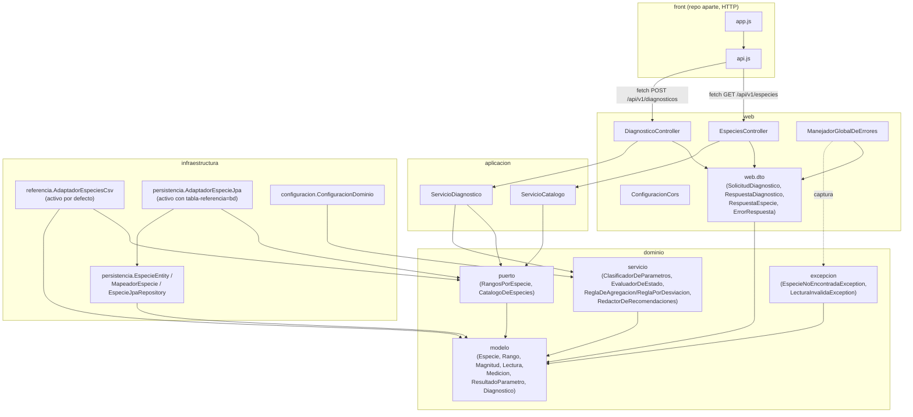
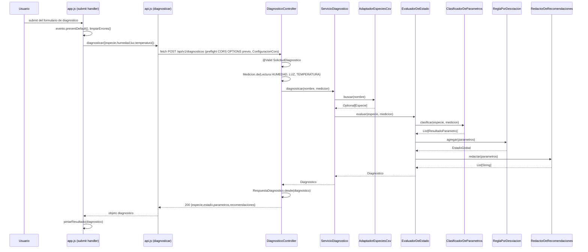
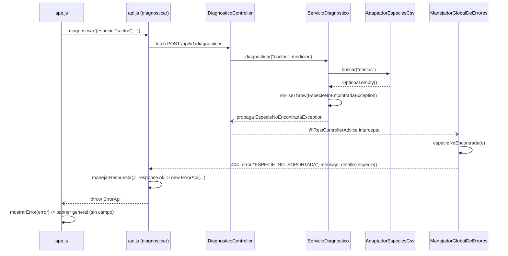

# Arquitectura — Fitodiagnóstico

Arquitectura de Software · U. Sergio Arboleda · 2026-2 · Santiago Ortegón, Santiago Castellanos

## 1. Diagrama de paquetes / componentes

Correspondencia verificada uno a uno con `find src/main/java -name "*.java"` (lista de clases y paquetes) y `grep -rn "^import com.vivero" src/main/java` (aristas reales entre paquetes) contra este diagrama; el archivo del front se listó con `find fitodiagnostico-frontend -maxdepth 2 -name "*.js" -o -name "*.html"`. No hay ninguna clase o dependencia en el diagrama que no exista en el código, ni ninguna dependencia real que falte aquí.

## 2. Diagrama de secuencia

### Recorrido feliz: diagnóstico de una planta saludable/en riesgo

### Recorrido de error: especie inexistente

## 3. Responsabilidades por capa

| Capa | Qué hace | Qué tiene prohibido | De qué depende |
|---|---|---|---|
| **front** (repo aparte) | formulario, `fetch` a la API, pintar resultado/error | conocer clases del backend; validar reglas de negocio (rangos por especie) | contrato HTTP del backend (JSON) |
| **web** | recibir/validar forma del DTO, invocar el caso de uso, traducir excepción→HTTP, habilitar CORS, garantizar que ningún error responda HTML (RA1, `ControladorDeErrores`) | tocar `infraestructura.persistencia` (RA-03, `el_controlador_no_toca_persistencia`); contener reglas de negocio | `aplicacion`, `dominio.modelo` (para DTOs) |
| **aplicacion** | orquestar el caso de uso (`ServicioDiagnostico`, `ServicioCatalogo`) contra los puertos | depender de `infraestructura` (`la_aplicacion_no_depende_de_infraestructura`) ni de `web` (`la_aplicacion_no_depende_de_web`) | `dominio` únicamente |
| **dominio** | modelo, reglas de clasificación/agregación/recomendación, puertos | conocer Spring ni JPA (RA-01, `el_dominio_no_conoce_frameworks`); depender de otra capa (`el_dominio_no_depende_de_otras_capas`) | nada del proyecto |
| **infraestructura** | implementar los puertos (CSV o JPA/Flyway), ensamblar los beans de dominio | dejar salir una `@Entity` fuera de `infraestructura.persistencia` (RA-04, `las_entidades_no_se_escapan`); nombrar Spring Data fuera de sí misma (RA-02, `spring_data_solo_en_infraestructura`) | `dominio` |

Todas las reglas citadas son campos `@ArchTest` de `ArquitecturaTest` (8 en total) que corren en cada `./mvnw test`; además, ninguna clase del proyecto usa `@Autowired` sobre campos (`sin_inyeccion_por_campo`, RA-09) — la inyección es siempre por constructor. `SinHtmlTest` verifica RA1 a nivel de contenedor real (`webEnvironment = RANDOM_PORT`): con `Accept: text/html`, ninguna ruta —ni las de error ni la consola de H2— responde HTML.

## 4. Justificación SOLID

**SRP.** [`ClasificadorDeParametros.java:17`](../src/main/java/com/vivero/fitodiagnostico/dominio/servicio/ClasificadorDeParametros.java#L17) solo clasifica; [`RedactorDeRecomendaciones.java:18`](../src/main/java/com/vivero/fitodiagnostico/dominio/servicio/RedactorDeRecomendaciones.java#L18) solo redacta texto; [`AdaptadorEspeciesCsv.java:43`](../src/main/java/com/vivero/fitodiagnostico/infraestructura/referencia/AdaptadorEspeciesCsv.java#L43) solo lee la tabla de referencia. Sin esta separación, cambiar el texto de una recomendación arriesgaría romper la clasificación por vivir en la misma clase. Sin tensión relevante: son clases pequeñas y sin estado, el costo es más saltos para seguir el flujo (visible en la sección 2).

**OCP.** [`ReglaDeAgregacion.java:13`](../src/main/java/com/vivero/fitodiagnostico/dominio/servicio/ReglaDeAgregacion.java#L13) es el punto de extensión; [`ReglaPorDesviacion.java:18`](../src/main/java/com/vivero/fitodiagnostico/dominio/servicio/ReglaPorDesviacion.java#L18) es la única implementación hoy. [`ClasificadorDeParametros.java:19`](../src/main/java/com/vivero/fitodiagnostico/dominio/servicio/ClasificadorDeParametros.java#L19) recorre `medicion.lecturas()` sin nombrar ninguna magnitud concreta; [`Magnitud.java:14`](../src/main/java/com/vivero/fitodiagnostico/dominio/modelo/Magnitud.java#L14) carga unidad, rango físico y las dos acciones como datos del enum. Sin esto, agregar una regla de agregación nueva o una magnitud nueva forzaría un `if`/`switch` dentro de `EvaluadorDeEstado` o `ClasificadorDeParametros`. **Tensión reconocida y verificada:** el cierre a modificación no llega al borde HTTP. `SolicitudDiagnostico` declara `humedad`/`luz`/`temperatura` como campos con nombre propio (no un mapa genérico), y `DiagnosticoController` construye las tres `Lectura` por nombre explícito. Agregar pH exige tocar el borde web aunque el pipeline de dominio (clasificar → agregar → redactar) no cambie una sola línea. Cuenta honesta de archivos (verificada leyendo el código, no estimada):
- Compartidos por ambos modos (4): `Magnitud.java` (constante `PH`), `SolicitudDiagnostico.java` (campo `ph`), `DiagnosticoController.java` (una `Lectura` más) y `ManejadorGlobalDeErrores.java` (agregar `"ph"` a `ORDEN_CAMPOS`, para que un pH ausente se reporte en orden determinista).
- Modo **csv** además (2): `AdaptadorEspeciesCsv.java` (agregar `PH` a `PREFIJO_COLUMNA`) y `especies.csv` (columnas `ph_min`/`ph_max`). Total modo csv: **6 archivos**.
- Modo **bd** además (4): `EspecieEntity.java` (columnas), `MapeadorEspecie.java` (mapeo) y una migración `V4` nueva en **cada** vendor (`db/migration/h2/` y `db/migration/postgresql/`). Total modo bd: **8 archivos**.
- Front (otro repo, 2): `index.html` (input) y `js/app.js` (referencias del input, error y rango).
- **No cambian:** `ClasificadorDeParametros`, `ReglaPorDesviacion`, `RedactorDeRecomendaciones`, `EvaluadorDeEstado`, `ServicioDiagnostico`, `RespuestaDiagnostico` ni `RespuestaEspecie` (estas dos recorren `Magnitud.values()`).
- *Corrección:* la primera versión de este documento decía 5 y 7; faltaba `ManejadorGlobalDeErrores`. Se detectó repasando la pregunta del pH con `grep` sobre las magnitudes.
- Soportando csv y bd a la vez: **10 archivos** (4 compartidos + 2 csv + 4 bd). `RespuestaDiagnostico`/`RespuestaEspecie` **no** se tocan: ya iteran `Magnitud.values()` genéricamente — ahí sí funciona OCP de punta a punta.

**LSP.** [`AdaptadorEspecieJpa.java:19`](../src/main/java/com/vivero/fitodiagnostico/infraestructura/persistencia/AdaptadorEspecieJpa.java#L19) y [`AdaptadorEspeciesCsv.java:43`](../src/main/java/com/vivero/fitodiagnostico/infraestructura/referencia/AdaptadorEspeciesCsv.java#L43) implementan los mismos dos puertos sin conocerse entre sí; [`ContratoFuenteDeEspeciesTest.java:26`](../src/test/java/com/vivero/fitodiagnostico/infraestructura/ContratoFuenteDeEspeciesTest.java#L26) corre las mismas 4 aserciones (listado ordenado, búsqueda insensible a mayúsculas, especie inexistente, rangos de sansevieria) contra las dos — es la evidencia ejecutable de sustituibilidad, no solo el argumento. Sin esto, nada garantizaría que cambiar `csv`→`bd` preserve el comportamiento observable. **Tensión reconocida y verificada:** en modo `csv`, `application.yml` (líneas 44-56 y 68-70) sigue declarando el datasource H2 y `spring.flyway.enabled: true` sin condicionarlos a `fitodiagnostico.tabla-referencia`; H2 arranca en memoria y Flyway corre las 3 migraciones aunque `AdaptadorEspecieJpa` esté desactivado y ninguna fila se lea de ahí. El propio `application.yml:6-7` deja esto documentado como tensión conocida.

**ISP.** [`RangosPorEspecie.java:12`](../src/main/java/com/vivero/fitodiagnostico/dominio/puerto/RangosPorEspecie.java#L12) (`buscar`) y [`CatalogoDeEspecies.java:11`](../src/main/java/com/vivero/fitodiagnostico/dominio/puerto/CatalogoDeEspecies.java#L11) (`listar`) son interfaces de un solo método; [`ServicioDiagnostico.java:25`](../src/main/java/com/vivero/fitodiagnostico/aplicacion/ServicioDiagnostico.java#L25) depende solo de `RangosPorEspecie`, [`ServicioCatalogo.java:20`](../src/main/java/com/vivero/fitodiagnostico/aplicacion/ServicioCatalogo.java#L20) depende solo de `CatalogoDeEspecies`. Antes de `ca61c34` existía un único `RepositorioEspecies` con ambos métodos: `ServicioDiagnostico` quedaba dependiendo de un `listar()` que nunca llama. Sin tensión relevante: ambos adaptadores igual implementan las dos interfaces porque ambos sirven a los dos casos de uso — ISP se demuestra del lado del consumidor, no oculta código del lado del proveedor.

**DIP.** Los puertos viven en `dominio.puerto`; las implementaciones concretas están en `infraestructura` y se activan solas vía `@ConditionalOnProperty` ([`AdaptadorEspeciesCsv.java:40-42`](../src/main/java/com/vivero/fitodiagnostico/infraestructura/referencia/AdaptadorEspeciesCsv.java#L40-L42), [`AdaptadorEspecieJpa.java:17-18`](../src/main/java/com/vivero/fitodiagnostico/infraestructura/persistencia/AdaptadorEspecieJpa.java#L17-L18)); [`ConfiguracionDominio.java:17`](../src/main/java/com/vivero/fitodiagnostico/infraestructura/configuracion/ConfiguracionDominio.java#L17) ensambla los beans de dominio. `ServicioDiagnostico` (constructor en la línea 25 ya citada) solo conoce el puerto. Sin esto, la aplicación importaría `EspecieJpaRepository` directamente — exactamente el bug que corrigió el commit `96a7fe2`, que agregó la regla `la_aplicacion_no_depende_de_infraestructura` porque la regla anterior (prohibir `org.springframework.data..`) pasaba en verde sobre código que nombraba el repositorio concreto en vez del paquete Spring Data. Tensión: ninguna nueva; el propio historial documenta que una regla ArchUnit insuficiente dejó pasar esa violación una vez.

## 5. Plan de evolución

**(i) Mediciones por MQTT desde un ESP32.**

| Se agregan | Se modifican | No se tocan |
|---|---|---|
| `infraestructura.entrada.SuscriptorMqttDiagnostico` (infraestructura, traduce mensaje MQTT → llama `ServicioDiagnostico`) | `pom.xml` (cliente MQTT) | `dominio.*` completo; `aplicacion.ServicioDiagnostico` (ya es agnóstico al transporte); `web.DiagnosticoController` (HTTP sigue vivo en paralelo) |

**(ii) Tabla de referencia a PostgreSQL.**

Ya existe una implementación relacional seleccionable por propiedad: `AdaptadorEspecieJpa` + perfil `postgres` en `application.yml` (líneas 82-97, credenciales por variable de entorno). El driver (`org.postgresql:postgresql`) y `flyway-database-postgresql` ya están en `pom.xml`, y las migraciones V1-V3 ya están duplicadas en `db/migration/postgresql/`. Lo que falta no es código: es levantar un servidor Postgres real y arrancar con `--spring.profiles.active=postgres --fitodiagnostico.tabla-referencia=bd` más `DB_URL`/`DB_USER`/`DB_PASSWORD`.

| Se agregan | Se modifican | No se tocan |
|---|---|---|
| nada en `src/main/java` | posible *tuning* del pool en `application.yml` | `dominio`, `aplicacion`, `AdaptadorEspecieJpa`, `EspecieEntity` (JPA/Hibernate ya es agnóstico de vendor) |

**(iii) Usuarios, cada uno con varias plantas.**

| Se agregan | Se modifican | No se tocan |
|---|---|---|
| `dominio.modelo.Usuario`, `dominio.modelo.Planta`; `dominio.puerto.RepositorioPlantas`/`RepositorioUsuarios`; `aplicacion.ServicioPlantas`; `infraestructura.persistencia.PlantaEntity`/`UsuarioEntity` + adaptadores; `web.PlantasController`; migraciones `V4` (usuario, planta) | `web.DiagnosticoController` (asociar diagnóstico a `plantaId`) | `dominio.servicio.*` (`ClasificadorDeParametros`, `EvaluadorDeEstado`, `ReglaPorDesviacion`, `RedactorDeRecomendaciones`) y `dominio.modelo.Especie/Rango/Magnitud` — evaluar una lectura sigue siendo el mismo cálculo, solo cambia quién lo pide |

**(iv) Gamificación (puntos, rachas, niveles).**

Va en un módulo aparte (p. ej. `dominio.gamificacion` + `aplicacion.ServicioGamificacion`), nunca dentro de `dominio` de diagnóstico: puntos y rachas son una política de *engagement* sobre el *historial* de diagnósticos de un usuario (depende de (iii)), no un umbral ambiental ni un estado de planta. Meterlo en `EvaluadorDeEstado` violaría SRP (una clase que evalúa y gamifica) y arriesgaría romper `ReglaPorDesviacion` cada vez que cambien las reglas de puntos.

| Se agregan | Se modifican | No se tocan |
|---|---|---|
| `dominio.gamificacion.Racha`/`Nivel`; `aplicacion.ServicioGamificacion`; `infraestructura.persistencia.RachaEntity`; `web.GamificacionController` | `aplicacion.ServicioDiagnostico` (publicar evento `DiagnosticoRealizado` en vez de acoplarse directo a gamificación) | `dominio.modelo.*` y `dominio.servicio.*` del diagnóstico |

## 6. Decisiones y alternativas descartadas

| Decisión | Alternativa descartada | Por qué se descartó |
|---|---|---|
| Estado global por **regla de agregación por desviación** (`ReglaPorDesviacion`, umbral 25 %) | Contar cuántos parámetros están fuera de rango; "la temperatura manda" sobre las demás | Contar no distingue un grado fuera de muy fuera; que una magnitud mande nombraría una constante concreta y un parámetro nuevo obligaría a abrir la regla (commit `396b39d`) |
| Parámetros ambientales como **datos** (`Magnitud` enum + `Medicion`) | `Ambiente(temperaturaC, humedadRelativa, luzLux)` con tres campos fijos | Cablear los tres como campos obligaba a tocar modelo, estrategias y evaluador cada vez que se agregara una magnitud (commit `3c96423`) |
| **Dos adaptadores** seleccionables por propiedad (`AdaptadorEspeciesCsv` / `AdaptadorEspecieJpa`) | Un solo adaptador (solo CSV o solo BD) | RA-05 exige que cambiar la fuente sea una clase nueva y cero cambios en el dominio; con un solo adaptador esa capacidad no sería un hecho verificable del repositorio (commit `53218de`) |
| **Dos puertos** separados (`RangosPorEspecie` / `CatalogoDeEspecies`) | Un `RepositorioEspecies` con `buscar` y `listar` | Mantener ambas operaciones en un puerto obligaba a `ServicioDiagnostico` a depender de un método que no usa (ISP, commit `ca61c34`) |
| **POST con cuerpo JSON** en `/api/v1/diagnosticos` | GET con query params (primera versión) | El front consume el contrato del Anexo A con un cuerpo `{especie,humedad,luz,temperatura}`; una medición completa a evaluar no es una búsqueda idempotente por query params (commit `23f1a34`) |
| **Dos repositorios** (backend / front separados) | Un monorepo con ambos | El front es un cliente independiente que solo conoce el contrato HTTP; vivir en repos separados hace visible esa frontera y obliga a versionar el contrato, no el código compartido (commits `4f50d7f`, `b3ef1cb`) |
